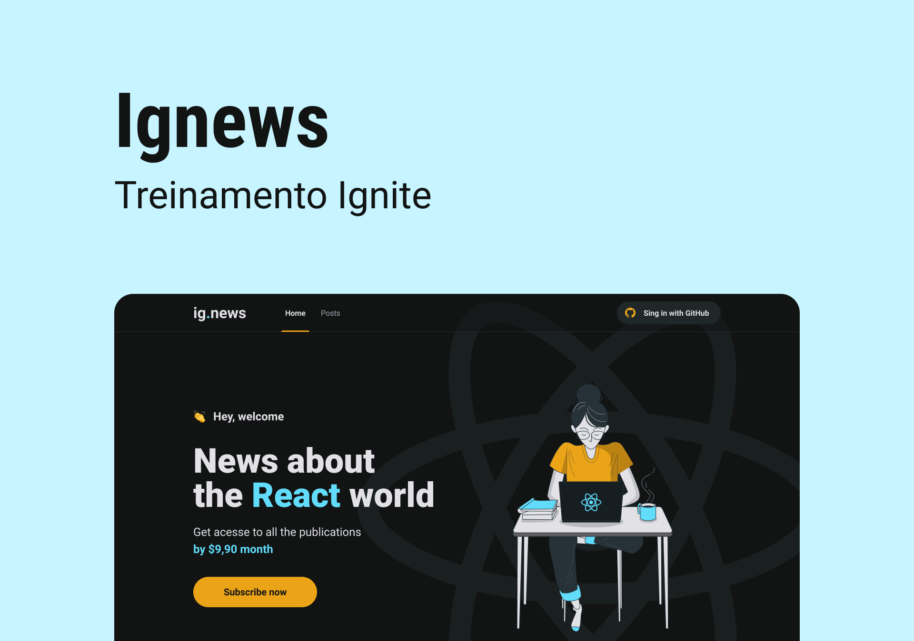

<h4 align="center">
    
    <br/>
</h4>

<p align="center">
  Seu portal de noticias 📰🚀
  <br>
  <br>

  

  <a href="https://rocketseat.com.br">
    
  </a>

  <a href="https://www.linkedin.com/in/leonardo-thomaz/">
    
  </a>

  <a href="https://github.com/LMThomaz/ignews/commits/main">
    
  </a>

  
</p>

---

## :dart: Como funciona?

O projeto consiste em ser um portal de noticias em formato de texto, sendo necessário uma assinatura mensal, para ter acesso completo.

Tendo sua autenticação no formato [OAuth do GitHub][url-oauth], os posts gerenciados pelo [Prismic][url-prismic], o controle de pagamento controlado pelo [Stripe][url-stripe] e a base de dados não relacional do [FaunaDB][url-fauna], o projeto foi construído sem possúir um servidor back-end!

## :art: O layout?

O layout da aplicação foi construído baseado no protótipo disponível no [Figma][url-figma].


## :hammer: Ferramentas?

O projeto utiliza as seguintes ferramentas

- [Next.js][url-next]
  - [React.js][url-react]
    - [React Icons][url-react-icons]
  - [TypeScript][url-ts]
  - [SASS][url-sass]
  - [Next Auth][url-next-auth]
- [Axios][url-axios]
- [Stripe][url-stripe]
- [Prismic][url-prismic]
- [FaunaDB][url-fauna]

## :electric_plug: Como usar?

É **necessário** que tenha instalado em sua máquina:

- [Git][url-git]
- [Node][url-node]
- [Yarn][url-yarn] ou [npm][url-npm]
- [VSCode][url-vs]

### :package: Obter a aplicação

Baixe o [.zip][url-zip] do projeto ou faça o clone executando:

```bash
$ git clone https://github.com/LMThomaz/ignews
```

### :steam_locomotive: Instalar dependências

No diretório raiz da aplicação, abra o terminal e execute:

```bash
  # Caso esteja usando yarn
  yarn

  # Caso esteja usando npm
  npm i
```

### :crystal_ball: Executar aplicação

#### :computer: Versão desenvolvimento

Após as dependências instaladas, execute:

```bash
  # Caso esteja usando yarn
  yarn dev

  # Caso esteja usando npm
  npm dev
```

#### :office: Versão produção

Após as dependências instaladas, execute:

```bash
  # Caso esteja usando yarn
  yarn build

  #Após a geração do build
  yarn start
```

```bash
  # Caso esteja usando npm
  npm build

  #Após a geração do build
  npm start
```

---

## :coffee: Como posso ajudar?

1. Faça o Fork deste repositório
2. Comece uma branch com sua feature

```bash
$ git checkout -b minha-feature
```

3. Confirme (Commit) seus feitos

```bash
$ git commit -m 'Minha nova feature'
```

4. Suba (push) sua branch

```bash
$ git push origin minha-feature
```

## :page_with_curl: Licença

O projeto está utilizando a licença MIT. Confira [LICENSE][license] para mais detalhes.

---

<h4 align="center">
Feito com 💜 por <a href="https://www.linkedin.com/in/leonardo-thomaz/" target="_blank">Leonardo Thomaz</a>
</h4>

[url-ts]: https://www.typescriptlang.org/
[url-figma]: https://www.figma.com/file/3qKkwsoACegxxTuIPxlq84/ig.news?node-id=3%3A7
[url-oauth]: https://docs.github.com/pt/developers/apps/authorizing-oauth-apps
[url-axios]: https://github.com/axios/axios
[url-next]: https://nextjs.org
[url-prismic]: https://prismic.io
[url-zip]: https://github.com/LMThomaz/ignews/archive/main.zip
[url-node]: https://nodejs.org/
[url-stripe]: https://stripe.com/en-br
[url-next-auth]: https://next-auth.js.org
[url-fauna]: https://fauna.com
[url-sass]: https://sass-lang.com
[url-react]: https://reactjs.org/
[url-react-icons]: https://react-icons.github.io/react-icons/
[url-rocketseat]: https://rocketseat.com.br/
[url-git]: https://git-scm.com/
[url-vs]: https://code.visualstudio.com/
[url-npm]: https://www.npmjs.com/
[url-yarn]: https://yarnpkg.com/
[diego]: https://github.com/diego3g
[diego]: https://github.com/diego3g
[license]: https://github.com/LMThomaz/ignews/blob/main/LICENSE.md
